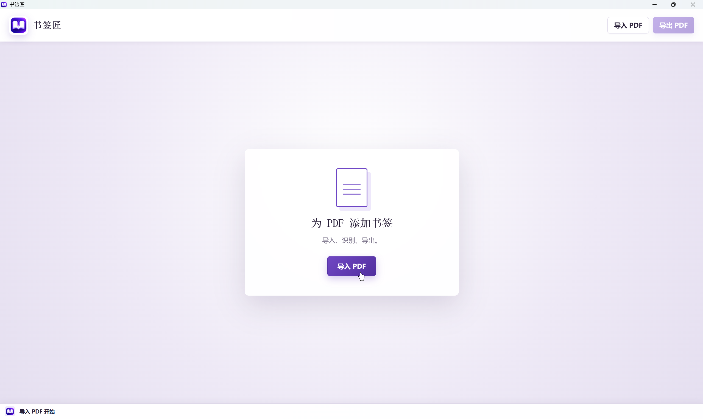
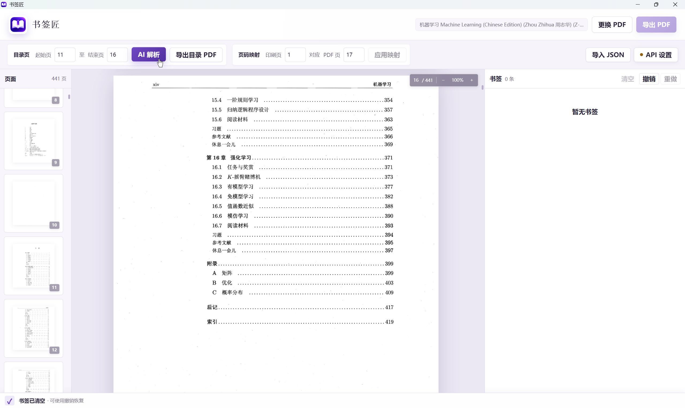
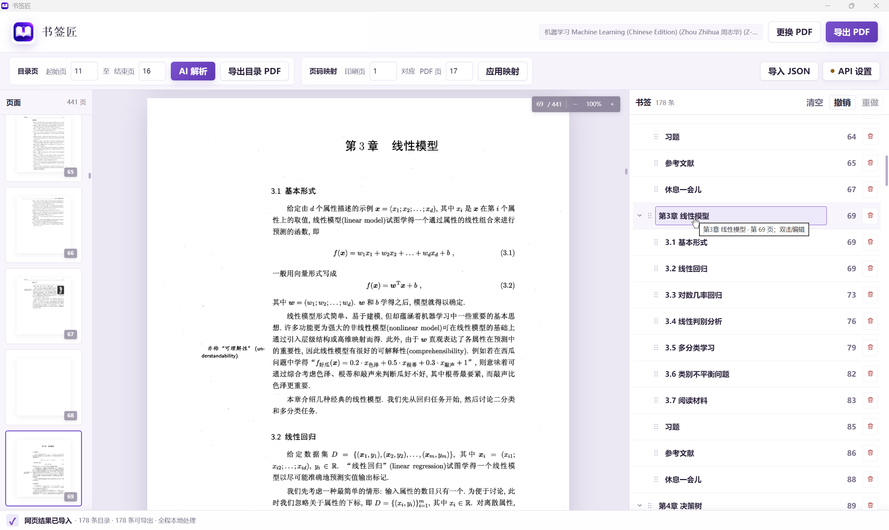

# 书签匠

书签匠是一款 Windows PDF 书签制作工具：导入电子书后识别目录页，校正目录层级和页码映射，再导出带书签的新 PDF。原文件始终保持不变。

<p align="center">
  
</p>

## 主要功能

- 连续预览 PDF，支持缩略图导航、高清缩放、页码跳转和文本选择。
- 读取并编辑 PDF 已有书签，也可以从目录页生成一套新书签。
- 支持 OpenAI Responses PDF 输入和 Chat Completions 多图输入。
- API 不可用时，可导出目录页 PDF、复制网页 AI 提示词并导入返回的 JSON。
- 支持阿拉伯数字、罗马数字和中文数字页码。
- 使用“印刷页对应 PDF 页”的单锚点映射目标页，导出前自动应用当前映射。
- 支持多层级书签、拖动排序、展开折叠、插入删除、撤销和重做。
- 长文档按视口渲染，限制画布内存，并对失败页面自动降级重试。
- 显示识别进度、Token、耗时和 Windows 完成通知。
- 导出时禁止覆盖原文件和已有输出文件。

## 安装

从 [GitHub Releases](https://github.com/Jiuxiao-yunwai/pdfmarker/releases) 下载 Windows 安装程序或便携版 EXE。

- 安装向导使用简体中文。
- 当前用户默认安装目录为 `%LOCALAPPDATA%\BookmarkCraftsman`。
- 需要 Windows 10/11 和 Microsoft Edge WebView2 Runtime。

## 使用方法

1. 导入 PDF，在连续预览中找到目录页，填写目录页的起止范围。
2. 配置多模态 API 后点击“AI 解析”，或导出目录页 PDF，使用网页 AI 识别后导入返回的 JSON。

<p align="center">
  
</p>

3. 设置页码锚点，例如“印刷页 1 对应 PDF 页 13”，再应用映射。
4. 在右侧检查书签标题、层级和目标页，可直接编辑、排序、删除或撤销操作。

<p align="center">
  
</p>

5. 点击“导出 PDF”，选择新的文件名保存带书签的副本。

## 本地开发

需要 Node.js 20+、Rust stable、Tauri 2 和 Windows WebView2 开发环境。

```powershell
npm install
npm run tauri dev
npm run build
cargo test --manifest-path src-tauri/Cargo.toml
npm run tauri:build:dev
```

项目结构和数据流见 [docs/architecture.md](docs/architecture.md)，版本记录见 [CHANGELOG.md](CHANGELOG.md)。
